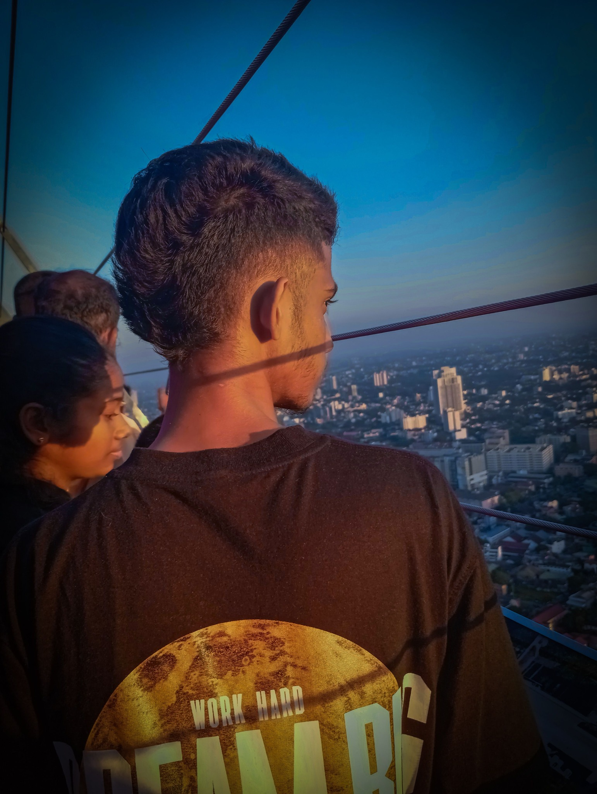

<!-- Banner or greeting -->

<h1 align="center" style="z-index:1;">Hi there, I'm Chamindu Senehas!</h1>

  

<h3 align="center">AI & Computer Science Undergraduate | Aspiring AI Engineer | Tech Explorer</h3>

---

### About Me
- 🎓 Currently pursuing a degree in **Artificial Intelligence & Computer Science**
- 💡 Passionate about **AI, Machine Learning, and Emerging Technologies**
- 🚀 On a mission to become a **high-demand AI professional**
- 🌱 I’m currently learning **MLOps**, **AI Engineering** and **Full Stack AI App Development**
- ⚡ Fun fact: I love combining **creativity and logic** to solve real-world problems

---

### 🔗 Connect With Me

---

### 🧰 Tech Stack & Tools

<!-- Languages -->

<!-- Frameworks & Libraries -->

<!-- GROQ API -->

<!-- LangGraph -->

<!-- LangChain -->

<!-- MLflow -->

<!-- CrewAI -->

<!-- Docker & DevOps -->

<!-- Databases -->

<!-- Vector Databases -->

<!-- Tools -->

---

### 📊 GitHub Stats & Analytics

  

  

  

---

### ⚙️ Projects & Focus
- 🧩 Building AI-powered apps with Flask & React  
- 💬 Exploring psychology-inspired AI systems

---

### 🌟 Quote
> "The best way to predict the future is to create it."
